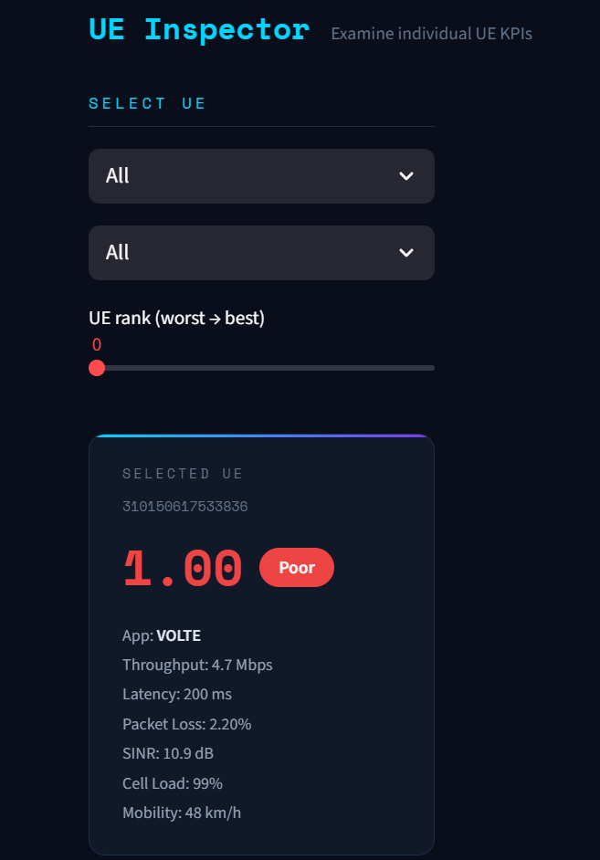
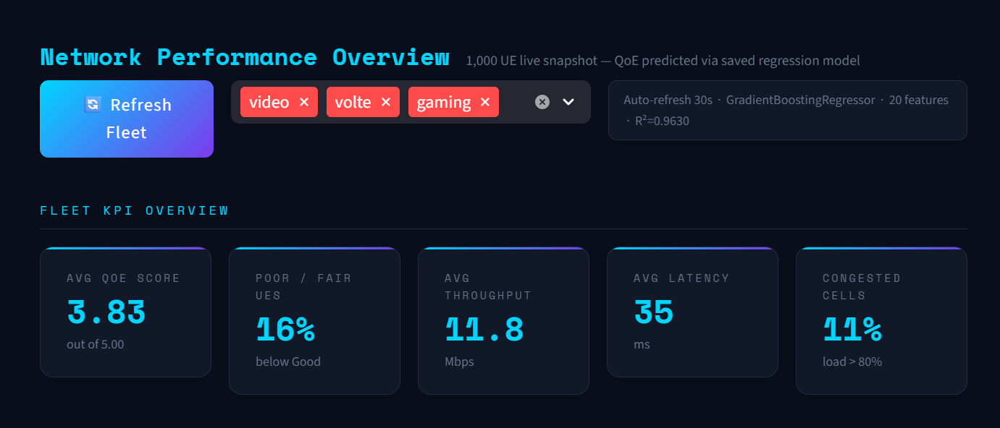
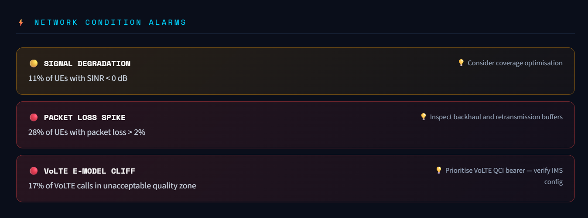
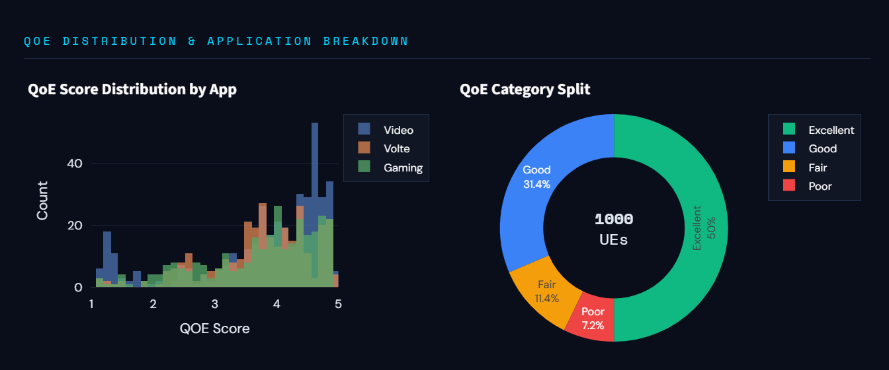
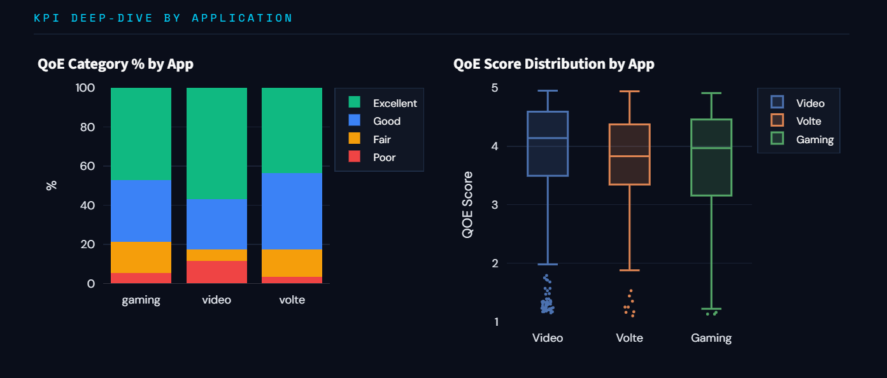
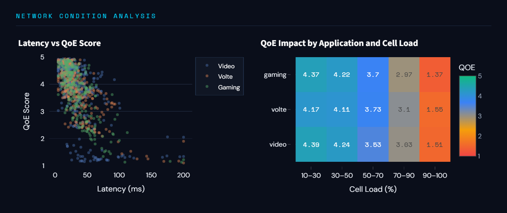
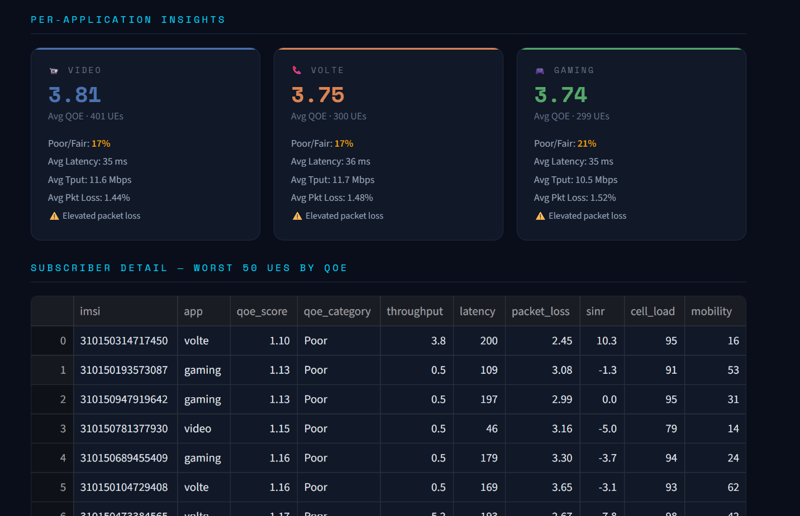
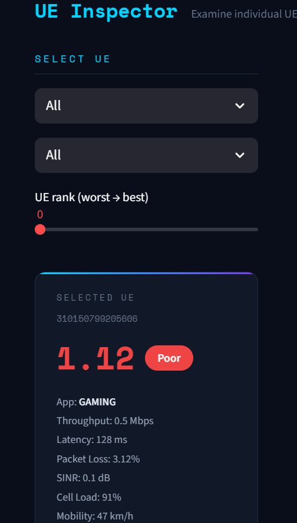

# 📡 Telecom QoE Intelligence Platform

> **End-to-end ML pipeline for predicting and monitoring Quality of Experience (QoE) across 1,000+ UE sessions in real-time — built for 5G/LTE network analytics.**


---

## 📋 Table of Contents

- [Overview](#overview)
- [Project Structure](#project-structure)
- [ML Pipeline](#ml-pipeline)
- [Dashboard Features](#dashboard-features)
- [Screenshots](#screenshots)
- [Quick Start](#quick-start)
- [Dataset & Features](#dataset--features)
- [Model Performance](#model-performance)
- [Tech Stack](#tech-stack)

---

## Overview

This project builds a complete **Telecom QoE prediction and monitoring system** using synthetic but physically grounded LTE/5G network data. It covers the full data science lifecycle:

1. **Data Generation** — Synthetic UE KPI dataset with correlated network conditions (5,000 samples)
2. **Feature Engineering** — 60+ engineered features including ITU-T E-model R-factor, Shannon capacity, goodput ratios, and app-specific cliff flags
3. **Model Training** — Gradient Boosting Regressor tuned via GridSearchCV (R² = 0.9630)
4. **Live Dashboard** — Streamlit app predicting QoE for 1,000 UEs in real-time with network alarms

**Applications:** Network Operations Centre (NOC) monitoring, subscriber experience management, proactive QoS optimisation.

---

## Project Structure

```
QOE Prediction/
│
├── Data generation/
│   ├── dataGenerator.py                    # Synthetic KPI dataset generator (v3 pipeline)
│   └── telecom_qoe_dataset.csv             # Generated raw dataset (5,000 UE sessions)
│
├── Model/
│   ├── telecom_qoe_feature_engineering.ipynb   # Feature engineering pipeline
│   ├── telecom_qoe_model_Reg.ipynb             # Model training, selection & saving
│   ├── telecom_qoe_features_full.csv           # All engineered features (60+)
│   ├── telecom_qoe_features_ml_ready.csv       # Selected 20 features (model input)
│   └── qoe_model.pkl                           # Saved model artifact
│
└── dashboard/
    ├── app.py                              # Streamlit dashboard (loads model only)
    └── qoe_model.pkl                       # Model copy for dashboard use
```

---

## ML Pipeline

```
Raw KPIs (8)                        throughput, latency, packet_loss, sinr,
                                    rsrp, cell_load, prb_utilization, mobility
        │
        ▼
Feature Engineering (60+)           Shannon capacity, E-model R-factor, goodput,
                                    interaction terms, log/sqrt transforms,
                                    app-specific cliff flags, health score
        │
        ▼
Feature Selection (20)              Consensus: Mutual Information + LassoCV
                                    + Random Forest (top-20, 2-of-3 vote)
        │
        ▼
RobustScaler                        Fit on train only (no leakage)
        │
        ▼
Gradient Boosting Regressor         GridSearchCV tuned
        │
        ▼
QoE Score [1.0 – 5.0]              MOS-style score → Poor / Fair / Good / Excellent
```

---

## Dashboard Features

### 📊 QoE Analytics Page

| Section | Description |
|---|---|
| **Fleet KPI Overview** | 5 live metric cards — Avg QoE Score, Poor/Fair %, Avg Throughput, Avg Latency, Congested Cells % |
| **Network Condition Alarms** | Real-time alarm engine detecting Cell Congestion, Latency Degradation, Signal Quality issues, Packet Loss Spikes, VoLTE E-model cliff, Gaming latency cliff |
| **QoE Score Distribution** | Overlaid histogram per application type (Video / VoLTE / Gaming) |
| **QoE Category Split** | Donut chart — Poor / Fair / Good / Excellent breakdown across 1,000 UEs |
| **Category % by App** | Stacked bar chart showing quality distribution per application |
| **KPI Deep-Dive** | Stacked bar (QoE category % by app) + box plots (score spread per app) |
| **Latency vs QoE Scatter** | Scatter plot coloured by application — shows E-model cliff behaviour |
| **QoE Impact Heatmap** | Avg QoE Score at each cell load bin (10–30% → 90–100%) per application |
| **Per-Application Insights** | Per-app summary cards with avg MOS, Poor/Fair %, key KPI averages, concern detection |
| **Worst 50 UE Table** | Colour-coded subscriber detail table sorted by lowest QoE score |

### 🔍 UE Inspector Page

| Section | Description |
|---|---|
| **UE Picker** | Filter by app type and QoE category, rank slider (worst → best) |
| **UE Detail Card** | IMSI, QoE score with colour-coded category badge, all raw KPI values |
| **Feature Contribution Chart** | Horizontal bar chart of all 20 scaled features sent to the model — green = above median (good), red = below median (bad) |
| **Feature Table** | Raw value + scaled value for each of the 20 model features, colour-gradient coded |

### Alarm Types

| Severity | Alarm | Trigger |
|---|---|---|
| 🔴 Critical | Cell Congestion | >40% UEs with cell load >80% |
| 🔴 Critical | Latency Degradation | >30% UEs with latency >100ms |
| 🔴 Critical | Poor Signal Quality | >25% UEs with SINR <0 dB |
| 🔴 Critical | Packet Loss Spike | >20% UEs with loss >2% |
| 🔴 Critical | Widespread Poor QoE | >35% subscribers Poor/Fair |
| 🔴 Critical | VoLTE E-Model Cliff | >15% VoLTE with lat>150ms or loss>2.5% |
| 🟡 Warning | High Cell Load | >20% UEs with cell load >80% |
| 🟡 Warning | Elevated Latency | >15% UEs with latency >100ms |
| 🟡 Warning | Signal Degradation | >10% UEs with SINR <0 dB |
| 🟡 Warning | Gaming Latency Cliff | >25% gaming UEs with latency >120ms |
| ✅ OK | All Systems Nominal | All KPIs within thresholds |

---

## Screenshots

### Sidebar & Model Info


### Fleet KPI Overview


### Network Condition Alarms


### QoE Distribution & Application Breakdown


### KPI Deep-Dive by Application


### Network Condition Analysis


### Worst 50 UE Subscriber Table


### UE Inspector


---

## Quick Start

### Prerequisites

- Python 3.10+
- Git

### 1. Clone the Repository

```bash
git clone https://github.com/YOUR_USERNAME/telecom-qoe-intelligence.git
cd telecom-qoe-intelligence
```

### 2. Install Dependencies

```bash
pip install -r requirements.txt
```

### 3. Generate the Dataset

```bash
cd "Data generation"
python dataGenerator.py
```

### 4. Run the Feature Engineering & Model Training Notebooks

Open and run all cells in order:

```bash
cd ../Model
jupyter notebook telecom_qoe_feature_engineering.ipynb
jupyter notebook telecom_qoe_model_Reg.ipynb
```

This produces `qoe_model.pkl` in the `Model/` directory.

### 5. Copy Model to Dashboard

```bash
cp Model/qoe_model.pkl dashboard/qoe_model.pkl
```

### 6. Launch the Dashboard

```bash
cd dashboard
streamlit run app.py
```

Open your browser at **http://localhost:8501**

---

## Dataset & Features

### Raw KPIs (8 inputs)

| KPI | Unit | Description |
|---|---|---|
| `throughput` | Mbps | Downlink user throughput |
| `latency` | ms | Round-trip latency |
| `packet_loss` | % | Packet loss rate |
| `sinr` | dB | Signal-to-Interference-plus-Noise Ratio |
| `rsrp` | dBm | Reference Signal Received Power |
| `cell_load` | % | Cell utilisation (PRB scheduling load) |
| `prb_utilization` | % | Physical Resource Block utilisation |
| `mobility` | km/h | UE speed (affects Doppler & handovers) |

### KPI Correlation Model (Data Generation)

The synthetic data uses physics-based correlations:

- **Cell load → SINR**: High load increases inter-cell interference (−0.12 dB per % above 50%)
- **SINR → Throughput**: Shannon-like capacity `log₂(1 + SINR_linear) × 3.5`
- **Cell load → Latency**: M/M/1 queuing model `10 / (1 − utilisation)`
- **Mobility → SINR**: Doppler penalty up to −8 dB at 120 km/h
- **Cell load distribution**: Bimodal (60% lightly loaded ≈35%, 40% congested ≈75%)

### Selected Features (20 — fed to model)

| Feature | Type | Description |
|---|---|---|
| `r_factor_proxy` | Domain | ITU-T G.107 E-model R-factor (voice quality proxy) |
| `goodput` | Domain | Effective throughput after packet loss |
| `goodput_lat_ratio` | Interaction | Goodput per unit latency — top model predictor |
| `mos_from_r` | Domain | MOS derived from E-model R-factor |
| `tput_lat_ratio` | Interaction | Throughput-to-latency ratio |
| `health_score` | Aggregate | Normalised composite benefit/impairment score |
| `loss_x_latency` | Interaction | Joint compound impairment (loss × latency) |
| `sinr_x_tput` | Interaction | Signal quality × delivered throughput |
| `r_factor_proxy` | Domain | R-factor proxy |
| `log_throughput` | Transform | Log-compressed throughput (right-skew correction) |
| `log_packet_loss` | Transform | Log-compressed packet loss |
| `packet_loss` | Raw | Raw packet loss % |
| `packet_loss_sq` | Polynomial | Squared loss (captures non-linear degradation) |
| `video_stall_risk` | Flag | Video UE with throughput <2 Mbps |
| `video_loss_flag` | Flag | Video UE with loss >1% |
| `volte_loss_cliff` | Flag | VoLTE UE with loss >0.5% (E-model audible threshold) |
| `game_loss_cliff` | Flag | Gaming UE with loss >1.5% |
| `sinr_per_prb` | Interaction | SINR per PRB unit (spectral density proxy) |
| `sqrt_throughput` | Transform | Square-root throughput |
| `throughput` | Raw | Raw throughput |
| `tput_tier` | Ordinal | Throughput quality tier [0–3] |

### QoE Score Categories

| Category | MOS Score | Description |
|---|---|---|
| 🔴 Poor | 1.0 – 2.0 | Unacceptable — service is unusable |
| 🟠 Fair | 2.0 – 3.0 | Degraded — noticeable impairment |
| 🔵 Good | 3.0 – 4.0 | Acceptable — minor impairments |
| 🟢 Excellent | 4.0 – 5.0 | Transparent — no perceptible degradation |

---

## Model Performance

| Metric | Value |
|---|---|
| Algorithm | Gradient Boosting Regressor |
| Feature Selection | MI + LassoCV + RF consensus (top-20, 2-of-3 vote) |
| Scaler | RobustScaler (fit on train only) |
| Train / Test Split | 80% / 20% (stratified) |
| Cross-Validation | 5-fold GridSearchCV |
| **R²** | **0.9630** |
| **RMSE** | **0.1878** |
| **MAE** | **0.1423** |

### Top 10 Feature Importances (GBM impurity)

| Rank | Feature | Importance |
|---|---|---|
| 1 | `goodput_lat_ratio` | 0.5277 |
| 2 | `r_factor_proxy` | 0.0950 |
| 3 | `tput_lat_ratio` | 0.0935 |
| 4 | `health_score` | 0.0814 |
| 5 | `mos_from_r` | 0.0599 |
| 6 | `loss_x_latency` | 0.0266 |
| 7 | `video_stall_risk` | 0.0174 |
| 8 | `sinr_x_tput` | 0.0146 |
| 9 | `volte_loss_cliff` | 0.0130 |
| 10 | `packet_loss` | 0.0119 |

---

## Tech Stack

| Layer | Technology |
|---|---|
| Language | Python 3.10+ |
| Dashboard | Streamlit 1.32+ |
| Visualisation | Plotly 5.20+ |
| ML | scikit-learn 1.4+ |
| Data | pandas 2.0+, NumPy 1.26+ |
| Model Persistence | joblib |
| Statistics | SciPy 1.12+ |
| Notebooks | Jupyter |

---

## Standards & References

- **ITU-T G.107** — E-model R-factor for voice quality estimation
- **ITU-T G.1010** — End-user multimedia QoS categories
- **3GPP TS 22.261** — Service requirements for 5G systems
- **ITU-T P.1203** — Parametric bitstream-based quality assessment (video)
- **Shannon-Hartley theorem** — Theoretical channel capacity from SINR

---

## License

MIT License — see [LICENSE](LICENSE) for details.

---

## Author

Built as a complete end-to-end telecom ML portfolio project covering synthetic data generation, feature engineering, model development, and production-ready dashboard deployment.
